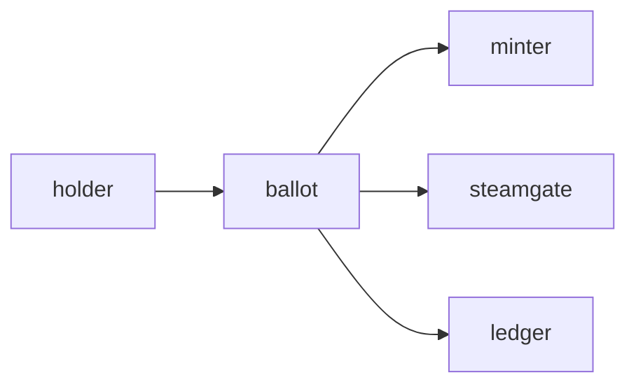

# Ballot

**Feature Voting App** — Lets token and NFT holders vote on the ComputerPets development roadmap.

Part of [ComputerPets](https://github.com/RicheyWorks/computerpets). Map: [computerpets-ecosystem](https://github.com/RicheyWorks/computerpets-ecosystem).

| | |
| --- | --- |
| Status | Design scaffold — contract frozen, implementation next |
| License | MIT |
| First pet | Still [Rui on the desktop](https://github.com/RicheyWorks/computerpets/blob/main/docs/START-HERE.md). This organ is optional. |

## The job

Holders propose. Weight comes from verified pets + optional VOTE credits. Steam-only players still get a capped voice so the chain does not own the game.

The flagship overlay already puts a living sticker on the real desktop (Rui first, 210 kinds). Ballot does not replace that. It is one organ.

## Who uses it

NFT holders and Steam-capped players voting the roadmap.

## What it is not

Not a DAO that can mint money. Steam-only still has a voice, capped.

## Architecture



## Stack

TypeScript · React 19 · snapshot-style votes · NFT / Steam weight · Ledger VOTE asset

GroupId / namespace: `com.enterprisepet.ballot`  
Default listen: `8080`

## Contract

### Data

`Proposal(id, body, deadline) · Weight(nftCount, steamCap) · Ballot(choice, weight)`

### Surface

- GET /v1/proposals — open / closed
- POST /v1/proposals — holder + steam identity
- POST /v1/vote — weighted, one ballot per proposal

### Failure doctrine

Sybil NFT wash → snapshot block, not live balance. Unverified voter → 401. After deadline → read-only.

## First slice

Build this and stop. Do not boil the ocean.

**One proposal + weighted vote. Snapshot of holdings at open, not live wash.**

You know it works when: Unverified 401. After deadline read-only. Wash trades after snapshot do not count.

## Environment

`LEDGER_URL`, `MINTER_URL`, `STEAMGATE_URL`

Never commit secrets. Never put Steam or chain keys in the overlay.

## Neighbors

- computerpets-minter
- computerpets-ledger
- computerpets-steamgate
- computerpets-console

## Layout

```
computerpets-ballot/
  README.md           this file
  LICENSE             MIT
  docs/CONTRACT.md    the same contract, frozen for implementers
  src/                implementation lands here
```

## Run (Windows)

PowerShell, from this folder, after the flagship helpers (Git, Node LTS 22+, JDK 21 as needed):

```powershell
cd app; npm install; npm run dev
```

You do not need this service to meet Rui. The [flagship start-here](https://github.com/RicheyWorks/computerpets/blob/main/docs/START-HERE.md) is still the first pet.

## Links

- Flagship: [RicheyWorks/computerpets](https://github.com/RicheyWorks/computerpets)
- This repo: [RicheyWorks/computerpets-ballot](https://github.com/RicheyWorks/computerpets-ballot)
- Map: [RicheyWorks/computerpets-ecosystem](https://github.com/RicheyWorks/computerpets-ecosystem)
- Contract file: [docs/CONTRACT.md](docs/CONTRACT.md)

## License

MIT. See [LICENSE](LICENSE).

---

*Two hundred ten living kinds. Keep them so a line does not go quiet.*
